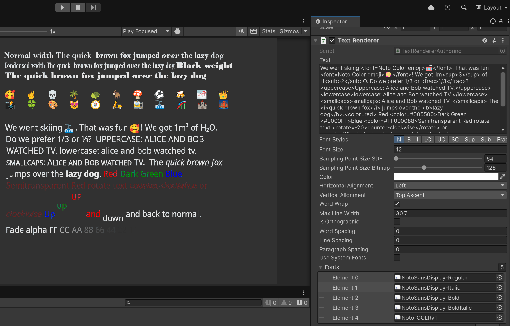

# TextMeshDOTS

TextMeshDOTS renders world space text similar to TextMeshPro. Its is a standalone text package for DOTS, 
forked from [Latios Framework/Calligraphics](https://github.com/Dreaming381/Latios-Framework/tree/master/Calligraphics). 

<b>Dynamic Atlas Textures</b> Prior to version 0.9.0, TextMeshDOTS used static font atlas textures from TextCore FontAssets. 
As of version 0.9.0, TextMeshDOTS generates all required font textures dynamically. Using the 
[Harfbuzz](https://harfbuzz.github.io/) library, TextMeshDOTS is now using native truetype (`*.ttf`) 
and opentype fonts (`*.otf`), and does not need Unity `Font` or `FontAsset`. 
The [HarfbuzzUnity](https://github.com/Dreaming381/HarfbuzzUnity) plugin for MacOS, Linux and Windows was made by Dreaming381. 

<b>Color Emoji :-)</b> TextMeshDOTS is now capable to render [COLRv1](https://developer.chrome.com/blog/colrv1-fonts) emoji fonts. 
Bitmap and svg emoji fonts are currently not supported. 

<b>Font Family support:</b> Lastly, a new feature in TextMeshDOTS version 0.9.0 is the ability 
to automaticaly work with font families, so e.g. select the "bold-italic" member when that style is selected (more below).

<b>Rich Text:</b> TextMeshDOTS supports many rich text tags like [TextMeshPro](https://docs.unity3d.com/Packages/com.unity.textmeshpro@4.0/manual/RichText.html) 
and TextCore (see section below for details). User selectable [opentype features](https://learn.microsoft.com/en-us/typography/opentype/spec/featurelist) 
can be enabled using rich text tags such as \<sub\>(subscript), \<sup\>(superscript), \<frac\> (fractions), \<smcp\> (smallcaps).

<b>Unity DOTS:</b> TextMeshDOTS leverages the [Unity Entities](https://docs.unity3d.com/Packages/com.unity.entities@1.2/manual/index.html) 
package, BURST, and jobs to generate all data required for rendering, and 
[Unity Entities Graphics](https://docs.unity3d.com/Packages/com.unity.entities.graphics@1.2/manual/index.html) 
for rendering. The included HDRP and URP shader are wrapper around the TextMeshPro 4.0 SRP shader. 

# How to use

(1) Autoring workflow
  -	Generate backend mesh and materials: `Menue --> TextMeshDOTS --> Text BackendMesh`, `Menue --> TextMeshDOTS --> Generate materials`
    - this only needs to be done once in a given project. The generated assets are placed into `Resources` folder, and are expected there by the runtime

  -	Create a `SubScene`
  -	Add empty `GameObject`, and `TextRenderer` component on it
  - As for font usage, you need to drop all fonts you intend to use in a given TextRender into the `Fonts` list. You got two options for doing so
    1. `System Fonts`: you want to use fonts that you know can be found on the target device
    2. you want to include the font files into your build
  - To use `System Fonts`, you can drop the `ttf` and `otf` files anywhere in your project. Unity cannot be stopped converting this 
    to a `font` asset, but this font asset is actually not needed and all information in it will be ignored. Drop the
    `Font` assets you wish to use in a given TextRender into the `Fonts` list. Utilizing harfbuzz, the backer will fetch requiered data 
    directly from the native `ttf` or `otf`file to be able to find the font at runtime on the device.
  - To include the font files into your build, create under `Assets` a subfolder called `StreamingAssets`. Drag and drop all 
    `ttf` and `otf` files you intend to use there. You can organize fonts in further subfolders as you wish. Drag and drop 
    all font files you wish to use in a given TextRender into the `Fonts` list.
  - Please note, that pretty much any font such as "Arial" in Windows actually constists of multiple font files (e.g. one for `regular`,
    one for `bold`, one for `italic`, one for `bold italic`. There can be many more to provide variations of font width 
    (regular, condensed etc) and weigth (Sembibold, Black etc). You need all of these files to enable TextMeshDOTS to 
    automatically select the right font when you apply FontStyles. Fontsyles are changed either using the buttons on 
    the TextRenderer, or via rich text tags such as \<b\>, \<i>. Alternatively \<font\> can be used to explicitly select a font.
    TextMeshDOTS can simulate bold and italic when those variants are missing, but this should be the exception and not the default.    
  - Type in some text or rich text  
  -	You should now see the text
  - Optional use of Gradients:
    - Add empty `GameObject`, and `TextColorGradient` component on it
    - Add any number  gradients to the list. You need to name the gradients to be able to select them 
      via the richtext tag \<gradient=name of gradient\> For horizontal gradients, specify at least the top left & right color. 
      For vertical gradients at least top & bottom-left. Otherwise specify all corner.

(2) Runtime instantiation workflow
  -	Generate backend mesh and materials: `Menue --> TextMeshDOTS --> Text BackendMesh`, `Menue --> TextMeshDOTS --> Generate materials`
    - this only needs to be done once in a given project. The generated assets are placed into `Resources` folder, and are expected there by the runtime
  -	Enable & modify `TextMeshDOTS/RuntimeSpawner/RuntimeSingleFontTextRendererSpawner.cs` or `RuntimeMultiFontTextRendererSpawner.cs` 
    as needed to spawn any number of `TextRenderer` entities. Per default, auto creation of both systems is disabled.
  - You will notice, that you need to manually fill out a lot of information in the `FontRequest` struct for every font 
    you intend to use. This information can be extracted utilizing the `FontUtility` Scriptable Object.
    
    - Right click in a folder, then `Create --> TextMeshDOTS --> Font Utility`
    - Drag and drop the fonts from `StreamingAssets` or from anywhere else in your project 
      (in case you intend to use `System Fonts`) into the font field, and copy the information 
      over into your runtime spawner. I know this is cumbersome, but I did not see it so far 
      as well invested time to automate runtime spawning via a baking workflow. I want to keep 
      only one unified path for triggering runtime font loading/unloading (via `FontBlobReference`)
  -	Hit play
  
(3) Changing text at Runtime
  - Text is stored the `CalliString` DynamicBuffer. Querry for that buffer and change it. All changed chunks will be re-processed 
    to generate the data requiered for rendering, and the entire GPU Buffer will be rebuild.
    - NOTE: Currently, TextMeshDOTS does not support incremental updates of the GPU buffer for only the changed entities 
   (in contrast to [Latios Framework/Calligraphics](https://github.com/Dreaming381/Latios-Framework/tree/master/Calligraphics)). 
    So even if just 1 entity out of 10,000 entitites changes, the entire GPU buffer will be rebuild. This could 
    incure a significant performence hit if you change text of just 1 entity every frame. The technical 
   reason for that is complexity related to avoiding GPU buffer fragmentation. (open to pull requests if someone figures out 
   how to use `ThreadedSparseUploader` (which comes with Entity Graphics Package) for such incremental updates)

# Supported Richtext Tags

\<align=...\> \<allcaps\>, \<alpha=xx\>, \<b\>, \<color=...\>, \<cspace=xx\>, \<gradient=...\>
\<font=...\>, \<font-weight=xxx\>, \<font-width=xxx.x\>, 
\<fraction\>, \<i>, \<indent=xx> \<lowercase\>, \<sub\>, 
\<sup\>, \<size=xx\>, \<space=000.00\>, \<mspace=xx.x\>, \<smallcaps\>, 
<scale=xx.x>, \<rotate=00\>, \<voffset=00\>.  Permitted size units are 'pt','px', 'em' and '%' or nothing 
(e.g. font-weight, font-width). Permitted values for named colors (\<color=red\>) are red, lightblue, blue,
grey, black, green, white, orange, purple, yellow. String values (such as named colors or font names) are recognized 
with and without surrounding quotation marks. Hexadecimal colors are either specified using the 
color keyword \<color=#005500\>, or directly without the color keyword as  \<#005500\>. 
Alpha values are specified via \<alpha=#FF\>.

# Known issues
  - \<aling\> works only for left, center and right (not justified and flush)
  - \<sub\> and \<sup\>  are currently implemented using the font opentype feature. For most 
    fonts, this only works  for digits and a few characters. One could simulate this via scaling & offsetting, 
   but this comes at the cost of glyphs that are optically too thin

## Special Thanks To the original authors and contributors

-   Dreaming381 - not only has he created the amazing [Latios Framework](https://github.com/Dreaming381/Latios-Framework), 
   including the Calligraphics text module, but has also been of tremendous support in figuring out how to create 
   a standalone version of Calligraphics that uses Entity Graphics instead of the Kinemation rendering engine. 
   Furthermore, Dreaming381 made the harfbuzz library accessible as plugin across platforms via the [HarfbuzzUnity](https://github.com/Dreaming381/HarfbuzzUnity) 
plugin for MacOS, Linux and Windows
-   Sovogal – significant contributions to the Calligraphics module of Latios Framework (including the name)
